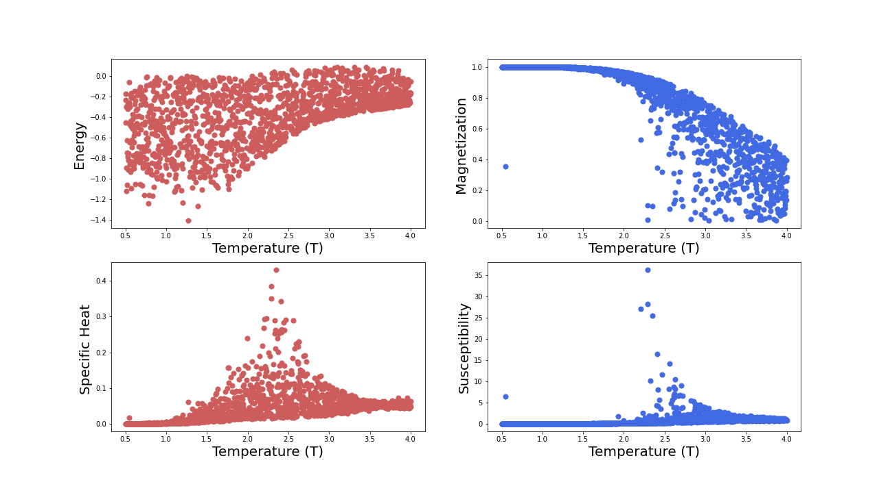
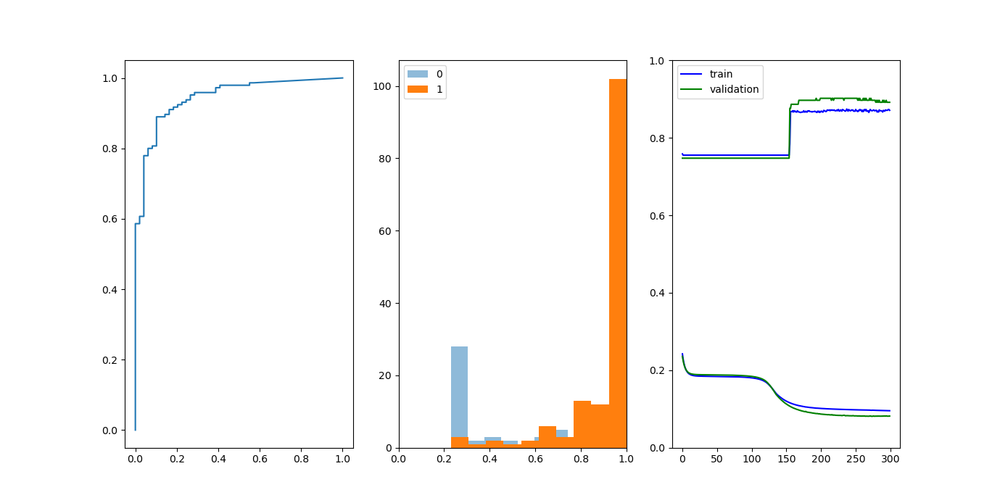

# AIFriendly-ising
AI-Friendly learns the system's equilibrium magnetization for the general problem<br>


---

<h2><p align="center">1) Generating a database</p></h2>

<b> Simulations of the 2d Ising problem with a constant field or arbitrary intensity can be generated by running in the console:</b>
  
```
python3 main.py
```
<br>
<sub><i>(as it is very CPU-intensive and the final size is smaller than 1Mb it is here provided. An alternative for generating it is running in Google Colab the script called "for_colab.ipynb")</i></sub>
<br>
A subproduct of generating the database is generating a graph that presents the four variables of interest as a function of temperature: Energy (E), Magnetization (M), Specific Heat (C) and Susceptibility (X) in western natural reading order respect.

<br>
<sub><i>(other 2D and 3D plots are also generated for taking into account the effect of the magnetic field applied to the system)</i></sub>


---

<b>Ising classification-results for AI-Friendly can be obtained by running "network_class.py". If you are using GoogleColab, which is encouraged, you must first populate the "datasets" directory with the "ising.csv" file saved in your Google Drive.</b><br>



