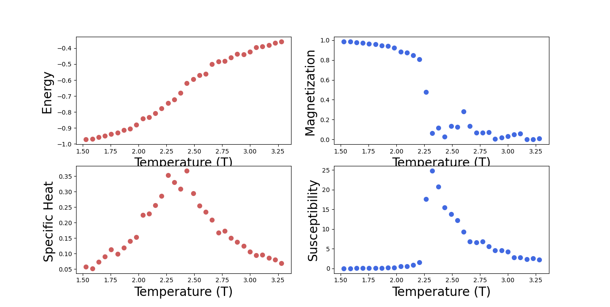
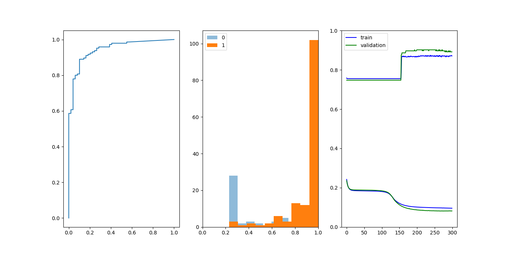

# AIFriendly-ising
AI-Friendly learns the system's equilibrium magnetization for the general problem 

<b> Ising-simulations are possible using "ising.py" and "isingmain.py"</b> 
 

<b>Ising classification-results for AI-Friendly are shown next</b> 

