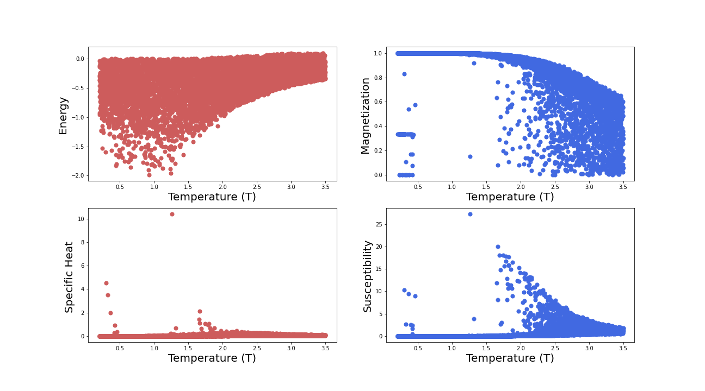

# AIFriendly-ising
AI-Friendly learns the system's equilibrium magnetization for the general problem 

<b> Ising-simulations are possible using "main.py" which calls "extras.py"; as they are CPU-intensive computations a 'Google Colaboratory' alternative is offered in the "for_colab.ipynb" file</b> 
 

<b>Ising classification-results for AI-Friendly can be obtained by running "network_class.py". If you are using GoogleColab, which is encouraged, you must first populate the "datasets" directory with the "ising.csv" file saved in your Google Drive.</b> 

